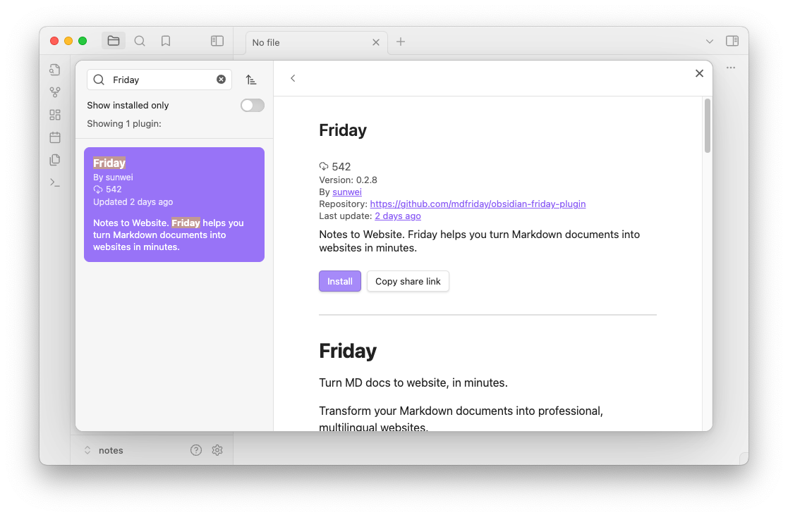
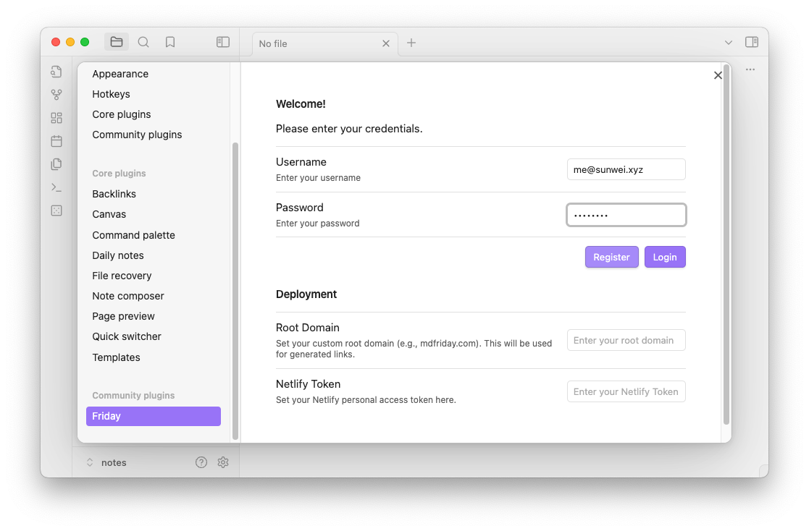
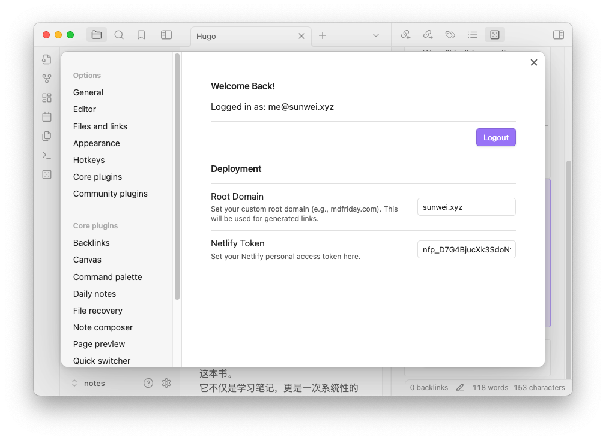
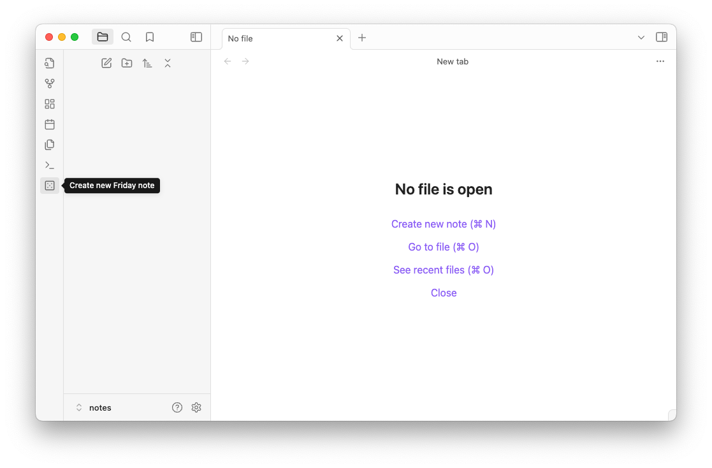
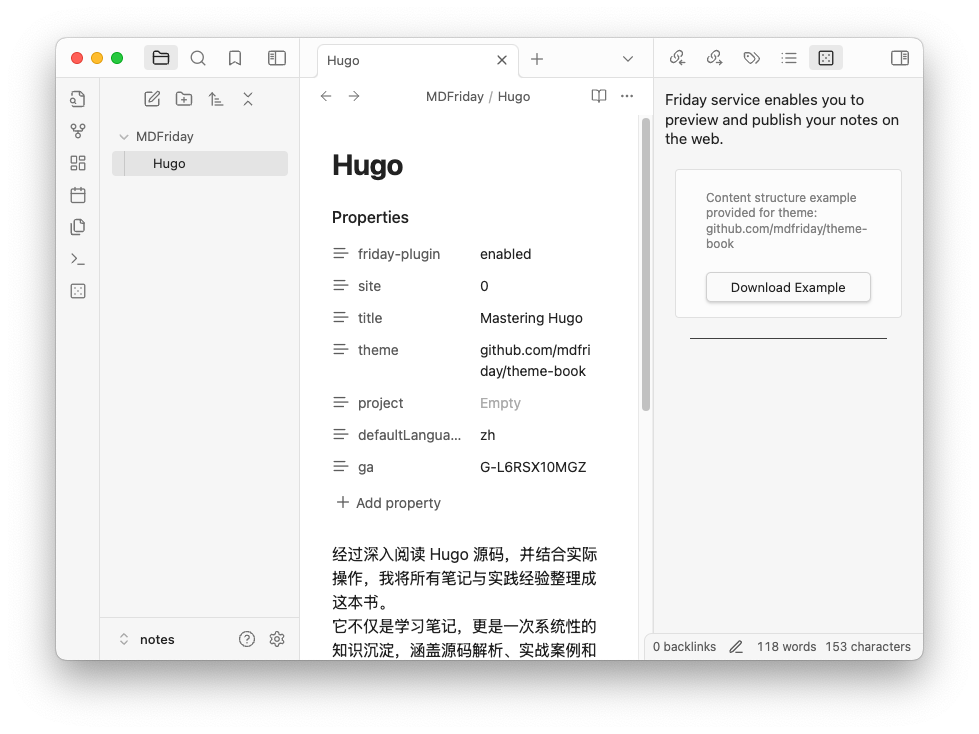
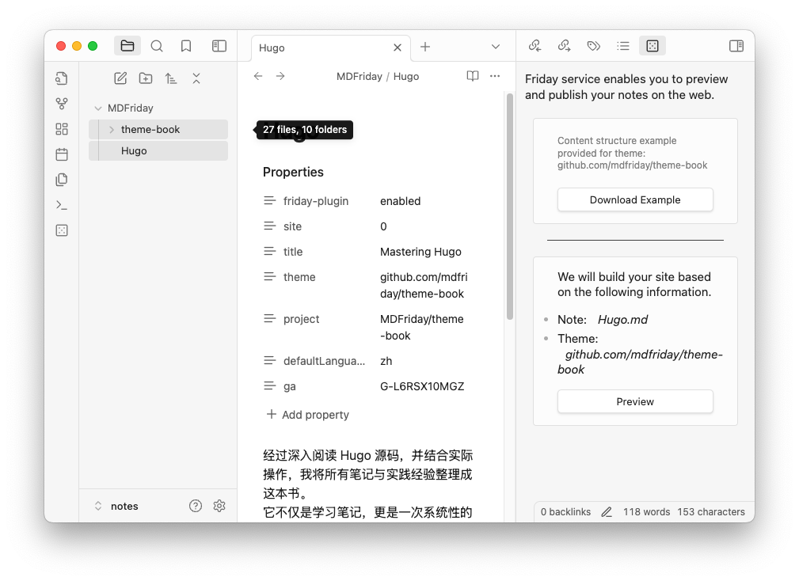
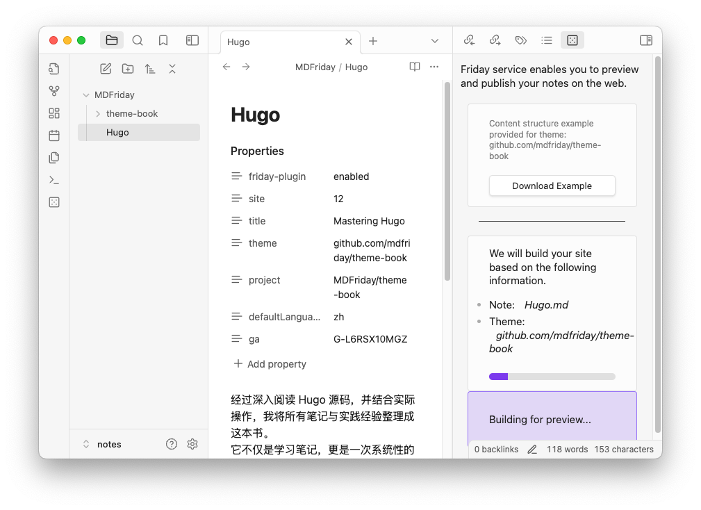
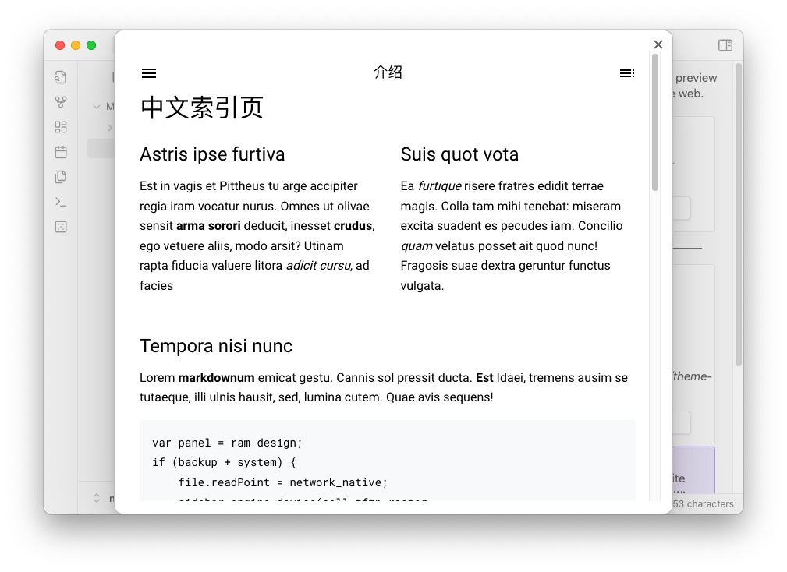
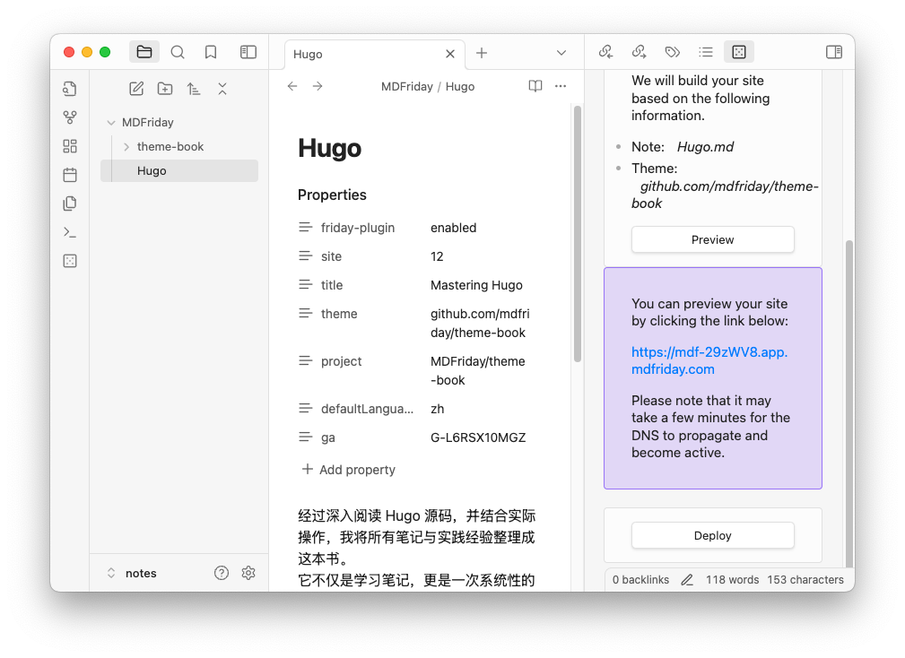

# Getting Started Guide
Welcome to MDFriday—your super easy, no-code tool for turning Markdown files into gorgeous websites! Whether you're sharing your latest blog post, creating a personal portfolio, or just having fun with your content, MDFriday makes it ridiculously simple. No programming required, just your ideas and a few clicks to bring them to life.

## Subscribing to MDFriday

Before you dive into creating your first website, you'll need to subscribe to one of our plans. 

 **[mdfriday.com](https://mdfriday.com/service/pricing)**



Check out this video for a quick introduction to using MDFriday, then follow the guide below to create your first website!

## Check Out Mr. Sun's First Website

>Mr. Sun is passionate about reading source code and taking notes along the way. After a few months of hard work, he's turned his notes into a book—_Deep Dive into Hugo_. He wanted to make it easily accessible, searchable, and shareable, so he decided to publish it on his personal website at **[https://hugo.sunwei.xyz](https://hugo.sunwei.xyz)**. Let’s take a look at how he used MDFriday to bring his project to life!

### **Step 1: Download theObsidian Friday Plugin and Register**  

#### 1. Install Obsidian and enable the Friday plugin.  

#### 2. Head over to the Friday plugin settings page to register and log in.  
 

#### 3. To deploy your site, you’ll need to provide your root domain and Netlify Token.

### **Step 2: Create new Friday note and Choose a Theme**  

#### 1. Create new Friday note

#### 2. Edit the Template Name  and  Change Title

* theme: github.com/mdfriday/theme-book  ( [Theme List](https://help.mdfriday.com/book/themes/) )

* Title：Hugo (You can modify your preferred name.)

### **Step 3: Download ,Preview and Deploy**  

#### 1. Download 

Click the Download Example button to automatically generate a sample notes folder and notes.

#### 2. Preview

Simply click the Preview button to see the sample preview in action.

Once the preview is successful, we’ll also provide you with a real site featuring a random domain name. You can click the domain to explore the details further.

#### 3. Deploy

If you have your own domain and have already configured the domain and Netlify Token in Step 1, Section 3, you can proceed by clicking the Deploy button to publish your site to your own domain.

### **Step4 :Update the Markdown Content** 

#### 1. Modify the Markdown file 
#### 2. After updating, repeat the preview and deploy process.

Wow, Mr. Sun’s website was set up so easily! Convenience was his first impression.
What are you waiting for? Start creating your first website now!