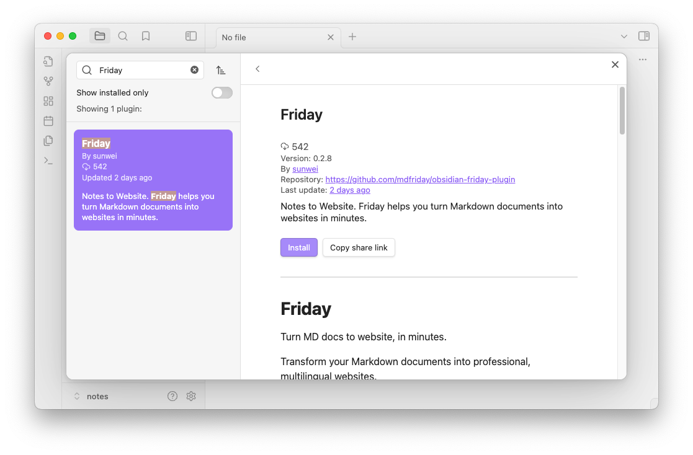
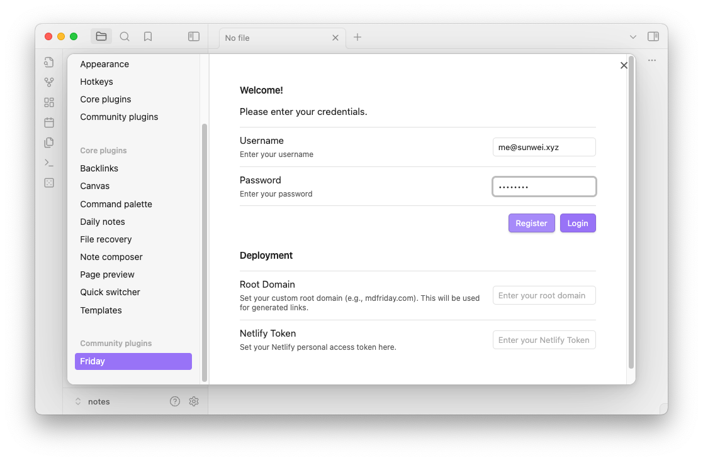

## 安装与注册

### 1. 下载 Obsidian Friday 插件
前往 Obsidian 官网，[下载](https://obsidian.md/download)并安装。

在 Obsidian 插件市场搜索 **Friday** 并安装。

### 2. 注册账号
点击 **Friday** 面板，使用你的邮箱注册一个账号。（接下来会在MDFriday官网提供注册入口）

### 3. 登录
注册成功后，会自动登录。

下面，我们就可以使用 MDFriday 进行网站创建。
