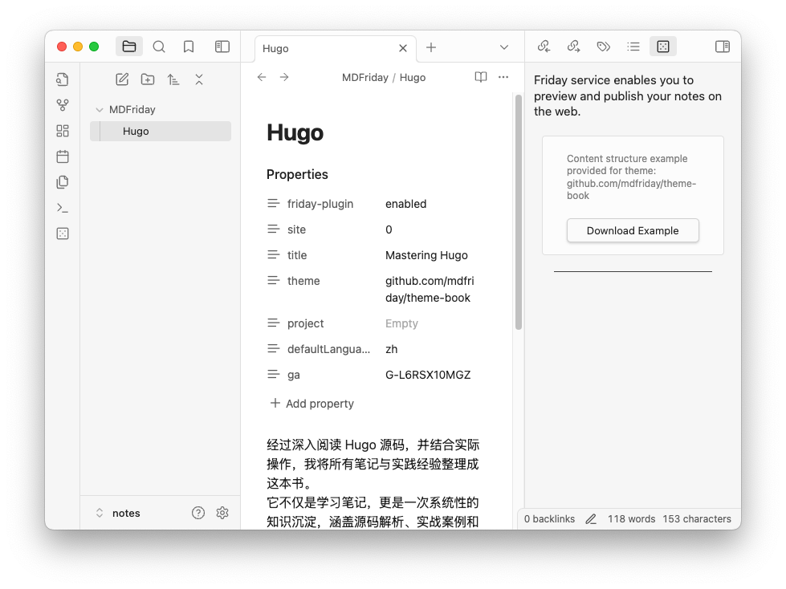
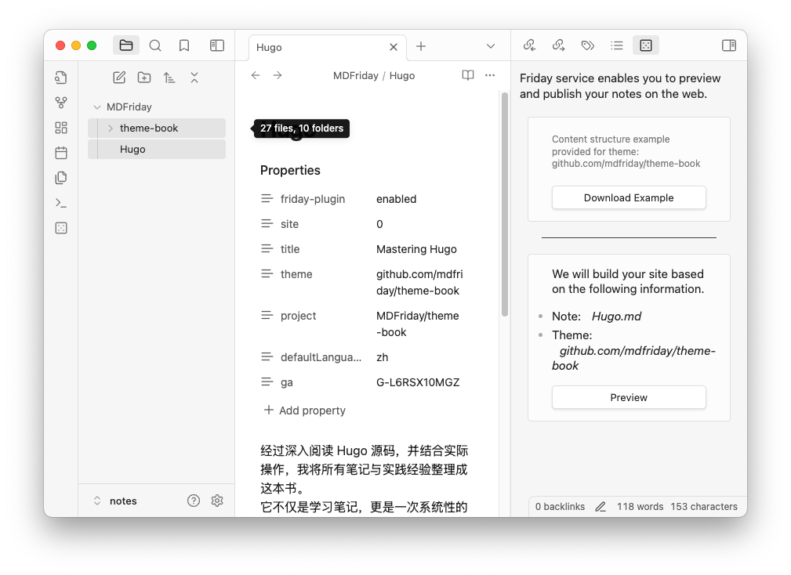
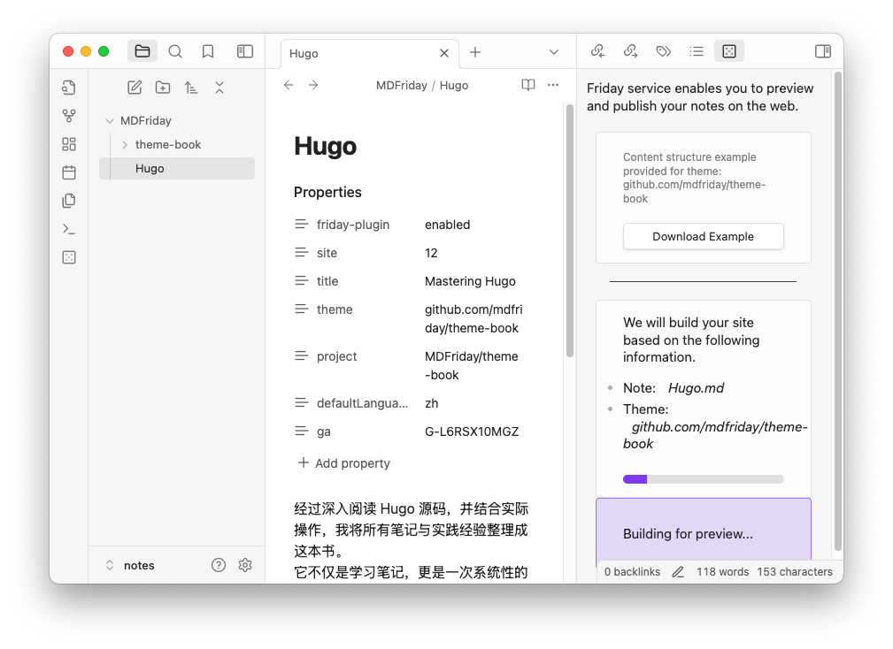
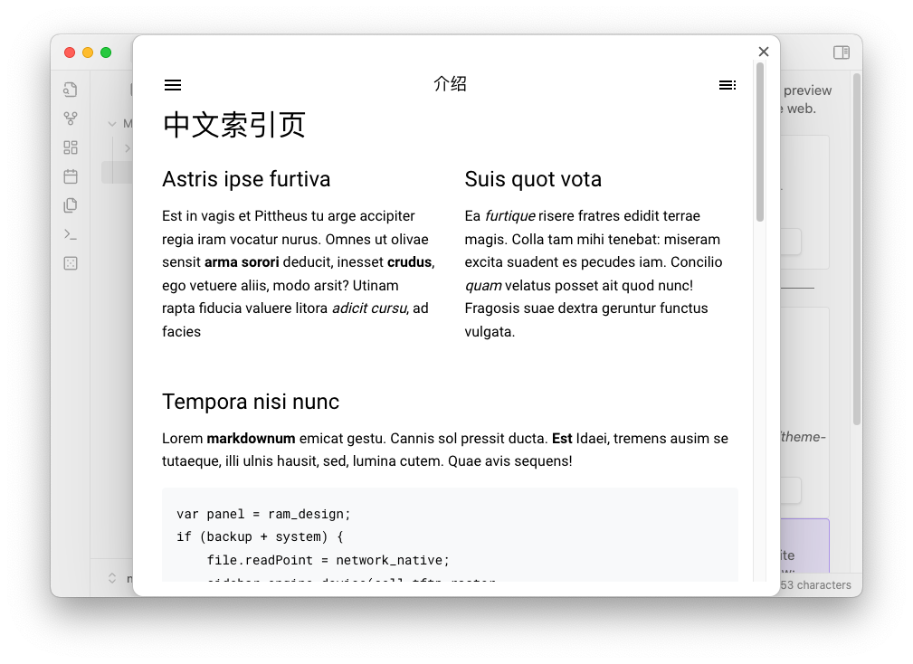
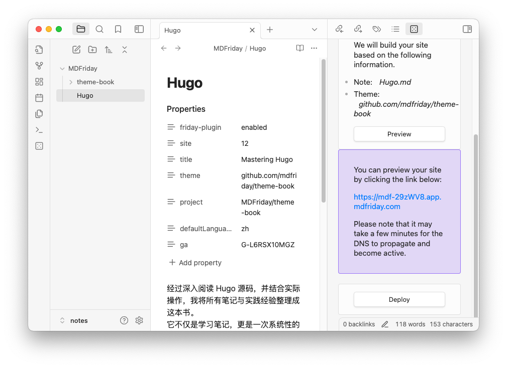
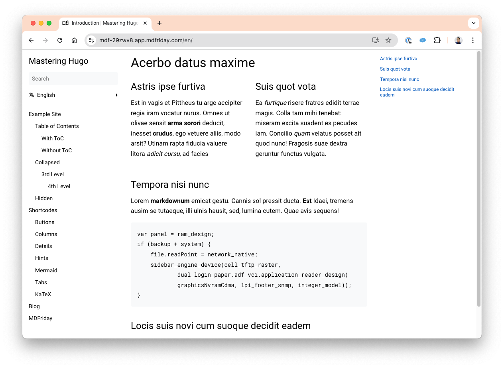

## 下载主题样例

选择好主题后，就可以点击右上方的 "Download Example" 按钮了:

下载过程中会显示下载进度条， 下载成功后：

- 样例会出现在 "MDFriday/theme-book" 目录下
- `project`属性会自动填充上相应路径"MDFriday/theme-book"，也就是和 Mastering Hugo 笔记的相对路径
- 当所有预览所需的信息都填充好后，右边功能栏会出现Preview功能按钮

## 预览

确认右边功能栏预览部分展示的预览基本信息，如无误，就可以直接点击`Preview`按钮，进行预览了。

### 预览进度条

### 预览成功

样例支持中，英双语。因为我们选择的默认语言是中文，所以这里首页，默认显示的是中文。

### 预览临时站点

预览成功的同时，我们还会为你提供一个随机域名的真实站点，你还可以点击域名进行更细节的查看。

{}
临时站点会在一个小时后由 MDFriday 自动回收。
{}

