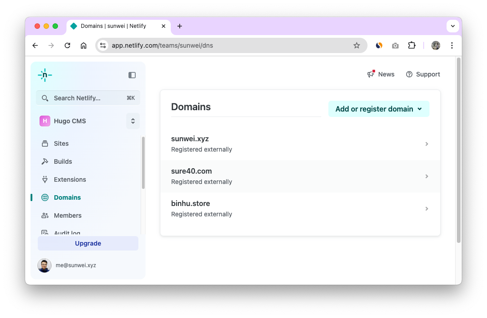
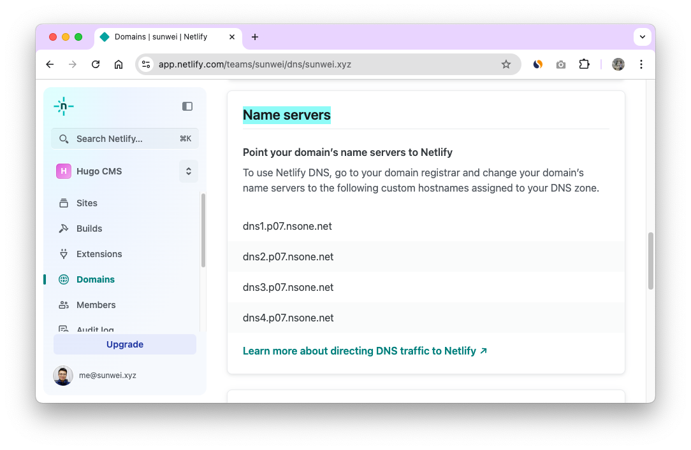
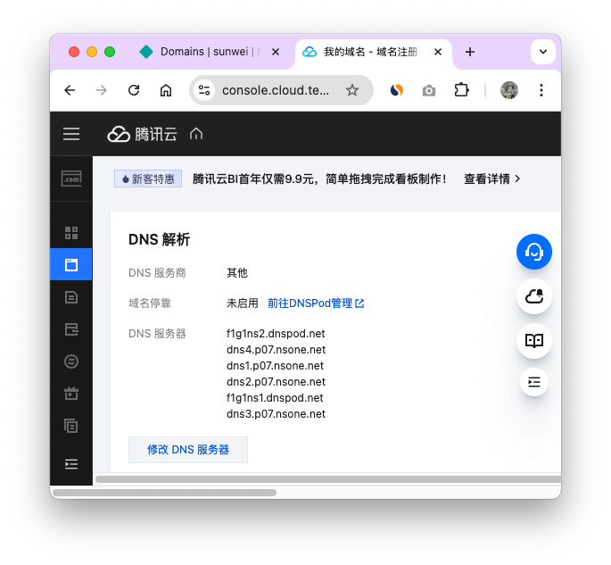
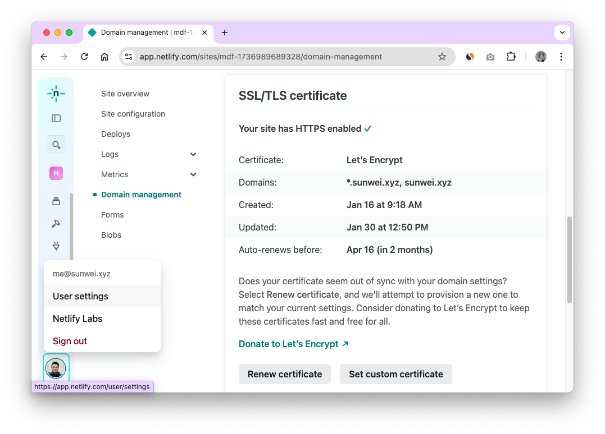
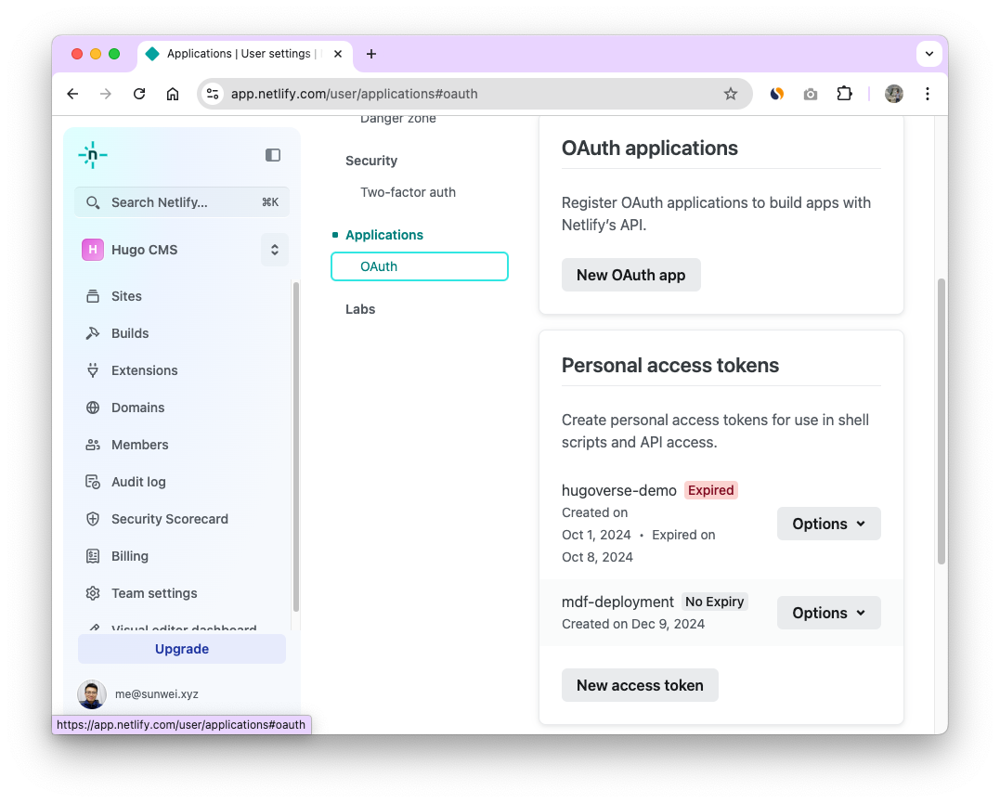

## Netlify部署

Netlify 提供的免费计划非常适合站点的启动和初期建设。
每月 100GB 的免费流量额度对于初创项目来说绰绰有余，而且还包含以下优势：

- 全球 CDN：确保访问速度快速稳定
- 免费 SSL 证书：自动配置 HTTPS，保障安全

对于刚起步的项目而言，这些功能完全能满足基本需求，让您专注于内容创作和功能开发，而无需过多关注基础设施的搭建和维护。
当站点发展壮大后，随时可以无缝升级到付费计划以获取更多资源。

[注册 Netlify 账号链接](https://app.netlify.com/signup)

### 配置域名

#### 添加你的域名

添加成功后，进入域名管理页面，查看 Netlify 的域名服务器。
在你注册域名的地方，把这些域名服务器都加到你的域名DNS列表里。
这样你的域名就被加入到了"互联网的电话簿"，大家都能查到你的信息了。

#### 配置 Netlify 域名服务器

在 Netlify 上查看分配给咱们的 Netlify 域名服务器，通常是四个:

将这四个域名服务器配置到我们的域名注册商那里。
样例里 `sunwei.xyz` 是在腾讯云上注册的，进入我的域名，选择 `sunwei.xyz`，可以看到DNS解析栏。

点击 `修改 DNS 服务器` 添加上面的四个 Netlify 域名服务器。

### 获取 Friday 所需要的凭证

#### User settings

进入用户设置页面

#### 创建凭证

在用户设置页面，选择中间的 `Applications -> OAuth` , 下滑页面至  `Personal access tokens` 。

点击下面的 `New access token` 按钮进行创建。

有了这个凭证后, MDFriday 就得到了你的授权，可以为你创建专业站点了。

