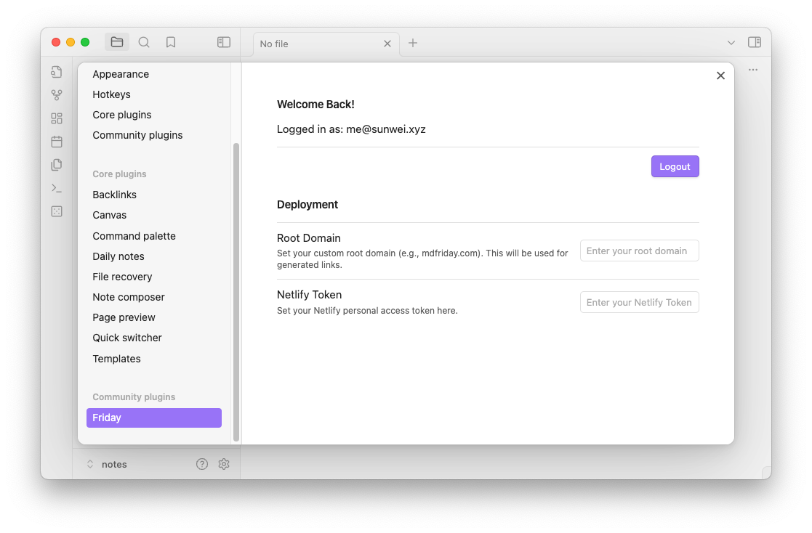
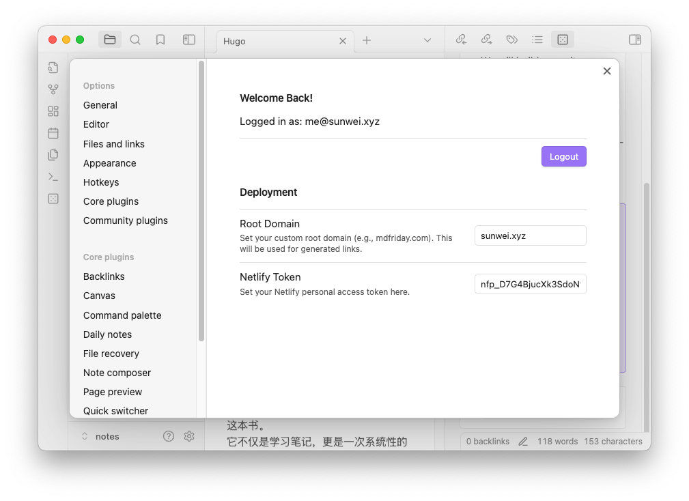
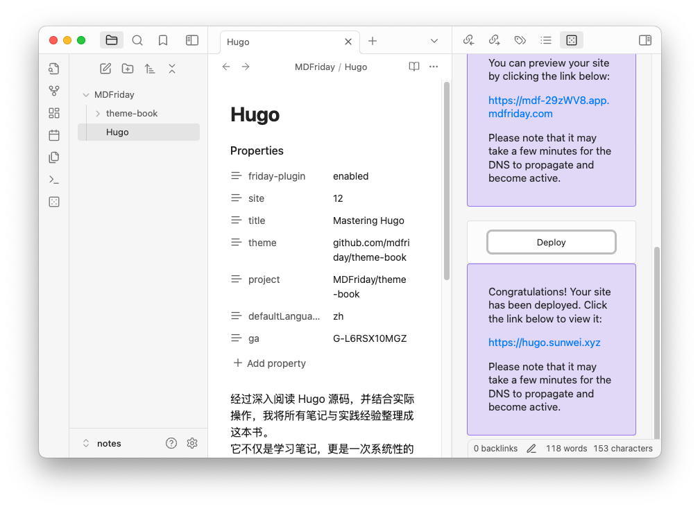
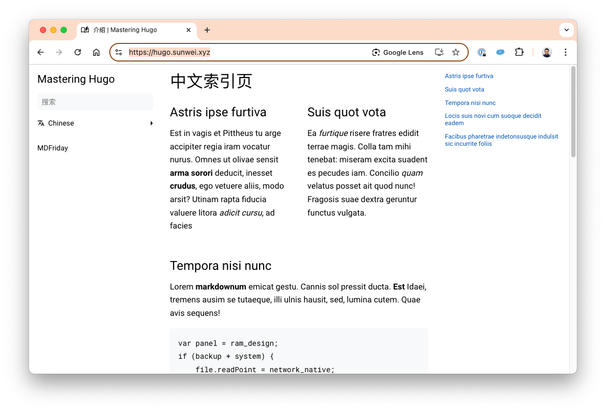

## 发布网站

当预览成功后，右侧功能栏将显示 `Deploy` 按钮，您可以一键部署您的网站。

如果您希望使用自定义域名，还需要进行一些额外配置。

MDFriday 始终坚持以**创作者为中心**，**尊重知识产权**。
我们相信，每一位创作者都应完全掌控自己的站点资源，包括域名、服务器和网站源码。
MDFriday 作为您的伙伴，致力于消除繁琐的技术细节，让您能够专注于内容创作，轻松拥有自己的独立网站。

当然，如果您选择全权交给MDFriday，我们也可以为你做得更多。

### 部署先决条件

如果想要部署到我们的自定义域名，我们需要提供下面两个信息：

1. 根域名
2. Netlify 凭证

{}
**云托管服务供应商**  
目前只支持 Netlify，后面会按需进行拓展。
{}

### 部署

将信息填充好后，我们就可以部署 《Mastering Hugo》到域名 `hugo.sunwei.xyz` 了。

点击笔记右下方 Deploy 按钮，部署到我们的自定义域名，和我们自己的 Netlify 账号:

这样我们《Mastering Hugo》就正式上线啦！

