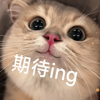

+++
title = "77.7K Star 的 Hugo 作者亲自回信！但他第一句话就让我彻底慌了……"
date = "2025-02-05"
weight = 999
+++

## **信心满满的我，发出了神圣的一封邮件**

作为一个 Hugo 的狂热粉丝，我一直觉得它是世界上最好的静态网站生成器，没有之一。
于是，我撸起袖子，耗时近一年多，在 Hugo 的基础上捣鼓出了一个名为 **Hugoverse** 的开源项目，试图打造一个更轻量的 Headless CMS。

### **Hugoverse 是什么？**

简单来说，它基于 Hugo 的模板语言和生态，但在架构上做了更现代化的设计：

🚀 **采用 DDD（领域驱动设计）架构**，让代码结构更清晰，逻辑更易扩展，避免了传统 Hugo 代码中的紧耦合问题。  
📌 **更加灵活的 API 设计**，相比 Hugo 主要依赖本地文件管理内容，Hugoverse 允许通过 API 操作内容，适用于更复杂的 Web 应用场景。  
🔗 **完全兼容 Hugo 生态**，支持相同的模板语言、短代码和主题，Hugo 用户可以无缝上手。  
🌍 **专注于网站构建**，Hugoverse 只做静态网站，不支持 JSON、AMP 等其他输出格式，让架构更加纯粹，性能更强。

目前，Hugoverse 已经落地在一个真实应用上：**Friday**，这是一个 Obsidian 插件，允许用户一键将 Markdown 笔记发布成完整的网站，而这一切的背后，正是 Hugoverse 提供的强大渲染支持。

虽然 Hugoverse 还处于早期阶段，但我坚信它能成为 Hugo 生态中的一股新力量！
于是，带着满腔热情，我鼓起勇气，给 Hugo 的缔造者——Bep 发了一封 **“充满敬意”** 的私信，希望得到他的认可，甚至梦想着能来一波官宣合作，实现双赢。

发完邮件，我满怀期待，仿佛等待着武林盟主亲自赐我一本秘籍。



发出的第一原始邮件：

```html
Hi Bep,

Hope you're doing well!

I wanted to reach out to hear your thoughts on Hugoverse, a Hugo-based headless CMS I’ve been working on. Initially, I started by integrating Hugo as an internal component, but due to its rapid updates, I eventually had to restructure it. Hugoverse is now a fully independent project, but it still follows the same ecosystem as Hugo—it uses the same template language, `layouts`, and `shortcodes`, making it very familiar to existing Hugo users.

Right now, Hugoverse is still in its early stages. One of the first applications built on top of it is **Friday**, an Obsidian plugin that allows users to publish Markdown notes as fully functional websites. The backend service for Friday is powered by Hugoverse. Here’s an example of the current workflow in action:
👉 **[YouTube Demo](https://www.youtube.com/watch?v=LiU-FeT7n28)**

Hugoverse is solely focused on building websites, so it doesn’t support other output formats like JSON, AMP, etc. This focus allows me to simplify the architecture while keeping the core functionality powerful and efficient.

Since you’ve shaped Hugo into what it is today, I’d love to hear your thoughts on this approach. Do you see a similar need within the Hugo community? Any advice on building a sustainable ecosystem around it?

I’d also be interested in exploring potential ways Hugoverse could align with and contribute to the broader Hugo ecosystem, whether through themes, compatibility, or other integrations.

Looking forward to your insights!

Best,
Sun Wei
```

---

## **Bep 回复了！结果他一开口，我直接破防！**

当我看到 Bep 的回复时，内心是狂喜的：

> “来了！Bep 竟然亲自回信了！我要上天了！”


结果打开邮件，一看内容，直接从天堂跌落人间。


Bep 的意思很明确：

1. **“你得对原项目更尊重一点。”** —— 这句话的潜台词好像是：“你小子是不是直接抄代码了？”
2. **“没有标注来源，最少是很没礼貌的。”** —— 这句话的潜台词好像是：“你这不是开源精神，这是白嫖精神。”
3. **“你还搞了一个看起来像官方的 GitHub 组织和域名？”** —— 这句话的潜台词简直是：“兄弟，你这是想鸠占鹊巢啊？”

这封邮件像一盆冰水，从头泼到脚，直接给我整不会了。

Bep回复的原始邮件：

```text
bep 23h

At first sight I would say that you need to be more respectful to the original project/source/license. 
Just copying code without any reference to the source is, at best, bad manners.

Also, creating a domain and GitHub group that looks like something Hugo official is also very questionable.

```

---

## **我：我错了，立刻改！**


作为一个**被偶像批评的迷弟**，我心里一万个崩溃。
明明是想贡献社区，结果被说成是个 **“抄袭大盗”+“品牌劫持者”**。

这能忍？不能！

于是，我赶紧回信认错，态度要端正，语气要诚恳，行动要迅速：

1. **立即补充 Hugo 的许可证和源码注释，强调 Hugoverse 的起源。**
2. **gohugo.net 这个域名，立刻归还，绝不让人误解。**
3. **GitHub 组织名字换掉，免得再让人误以为 Hugoverse 是官方项目。**

邮件发出后，我感觉自己像个闯祸的熊孩子，终于意识到事情的严重性，开始立马补救。

回复的邮件原文：

```text
Hi Bep,  

My bad, no excuse. 

Thank you for your feedback. 
I truly respect the Hugo project and your work, and I want to make sure I handle this properly.  

1. Regarding the source code, I acknowledge that a large part of Hugoverse is based on Hugo's code, 
with some modifications and restructuring. If the main issue is the lack of proper attribution, 
I will immediately add clear references to Hugo's license in the source code headers and README to give proper credit.  

2. As for the gohugo.net domain and the GitHub group gohugonet, I now understand your concerns. 
My intention was never to mislead anyone into thinking this was an official Hugo project. 
To resolve this, I am happy to donate the gohugo.net domain and move Hugoverse to a different GitHub group to avoid any confusion.  

Please let me know if there’s anything else I should do to align better with the original project’s 
values. I appreciate your guidance.  

Best,  
Sun Wei
```

---

## **最后，来点自嘲**

原本我幻想的是：

> “兄弟，你的 Hugoverse 真的很棒！要不你来 Hugo 官方贡献一波？”

结果现实是：

> “兄弟，你这样做不太尊重 Hugo 啊……要不先把名字和代码注释改一改？”

只能说，期待越高，摔得越惨。

**但也正是因为摔了一跤，我才真正学会了如何在开源社区里‘优雅地成长’。**

**PS：希望未来能靠 Hugoverse 重新证明自己，而不是靠“惊险邮件事故”出名。** 😆

---

## Apache License

Hugo和Hugoverse都是采用的Apache License 2.0。

Apache License 2.0 允许你自由地使用、修改和分发代码，包括将其用于商业用途，但有几个重要的要求需要遵守：

### **1. 需要保留原始版权声明和许可证**
如果你直接拷贝了代码（无论是否修改），你必须：
- 保留原始文件中的版权声明（如果有的话）。
- 附带完整的 Apache License 2.0 许可证文本（可以是 LICENSE 文件）。
- 在你的项目的 README 或文档中，标明部分代码来自 Apache 2.0 授权的项目，并提供原始项目的链接。

### **2. 需要添加 NOTICE 文件（如果原始项目有的话）**
如果原始项目包含 `NOTICE` 文件，你也必须在你的项目中包含该文件，并且不能删除其中已有的声明。

### **3. 不能使用原项目的商标**
如果原项目的代码或文档中包含商标、品牌标识、logo，你不能使用它们（除非获得授权）。

### **4. 允许修改和闭源（但要注明修改过的部分）**
- 你可以修改代码并将其闭源，但如果你重新发布（特别是作为开源项目），需要说明哪些部分被修改过。
- 你不需要强制开源你的修改内容（不像 GPL）。

### **示例**
假设你在一个 Golang 项目中引入了 Apache 2.0 许可的代码，你可以在你的 `LICENSE` 或 `NOTICE` 文件中添加类似信息：
```
This project includes code from [Project Name] (https://github.com/example/repo),
licensed under the Apache License, Version 2.0 (https://www.apache.org/licenses/LICENSE-2.0).
```

### **总结**
如果你拷贝了 Apache 2.0 代码，至少要做这几件事：
✅ 保留版权声明和 LICENSE 文件  
✅ 如果有 `NOTICE` 文件，也要保留  
✅ 说明哪些代码来自 Apache 2.0 项目，并提供原始链接  
✅ 避免使用原项目的商标、logo  
✅ 允许修改并闭源，但如果重新开源要标注修改内容

这样就能合法合规地使用该代码了！

也希望大家以此为戒，共勉！