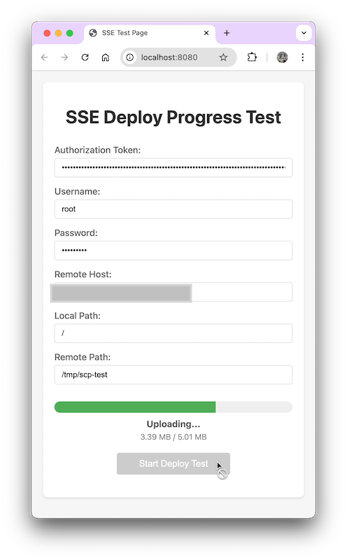
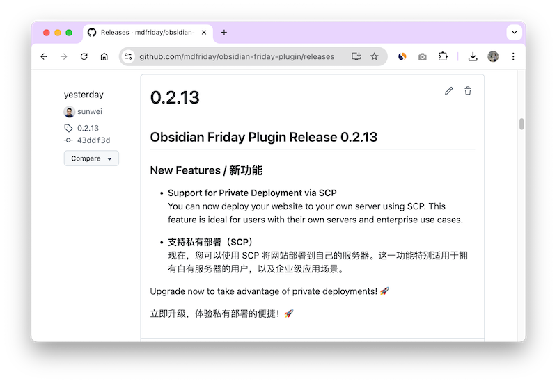

+++
title = "AI 时代的个人开发者：从需求到上线，只需三天！"
date = "2025-03-02"
weight = 998
+++

# AI 时代的个人开发者：从想法到上线，只需三天！（基于 MDFriday 的私有部署功能）

> AI: Cursor Claude-3.7
>
> MDFriday：一款能将多个 Markdown 文件转换为专业站点的 SaaS 服务

所有工作， **95% 都是 AI 干的！另外 5% 是我敲的提示词！**

一起来看 AI 战力：前端加后端，共修改**2748**行！


## 前端

```shell
➜  obsidian-friday-plugin git:(main) git log --pretty=tformat: --numstat 87772da6b053eb9ec4cda02bf6d2d128942588a4..43ddf3de3665e5e56b3adb4e480d50992011ac5b | 
awk '{ added += $1; removed += $2 } END { print "Added lines:", added, "\nRemoved lines:", removed, "\nTotal changes:", added + removed }'

Added lines: 468 
Removed lines: 43 
Total changes: 511

```

## 后端

```shell
➜  hugoverse git:(main) git log --pretty=tformat: --numstat b241be4d0e10bcc2bcf35a2f03a9ee8cd9c8671e..471fb64d8c452199e0fa017f8f6fd7c630c29e54 | 
awk '{ added += $1; removed += $2 } END { print "Added lines:", added, "\nRemoved lines:", removed, "\nTotal changes:", added + removed }'

Added lines: 1785 
Removed lines: 452 
Total changes: 2237
```

## 需求来自缘分：将MDFriday生成的站点源码，部署到自己的服务上。

掘金在一个月前给我推了篇文章《2024年终复盘: 1600个小时的创业之旅》。
不由得感叹这算法，真准！因为我确实对个人开发相关的事情都很感兴趣。
当我点开的那一瞬间，吸引力法则又一次生效了。

同样是开发者，看到作者 - [徐小夕](https://juejin.cn/user/3808363978429613/)这么优秀，还是掘金签约作者。

私信，加好友，一气呵成！这个时候，脸皮厚就成了优点，哈哈哈。
聊着聊着就发现，他的公司就在武汉！聊着聊着就发现，我们俩相距就1.5公里！这，就是缘分啊，兄弟姐妹们！


见面聊得很欢快，因为太多相似点：都是开发人员，都有自己的开源项目，都想着怎么让服务能帮助到更多的人。

交谈过程中，了解到他们正在准备Dooring的国际站，对MDFriday的一款主题Saasify比较感兴趣，而且还希望部署到自己的服务器上。

## 方案设计：AI 一出手，效率高到有点不真实

于是，我跑去找 Cursor（AI 代码助手），它一听就说：“可以用 WebSocket，也可以用 SSE（Server-Side Events）。”

我心想：**这不就是单向传输的场景吗？** 于是回了一句：“单向的。”

Cursor 立刻调整思路：“那 SSE 方案更合适。”

然后，不出半小时，TA 直接甩给我一套完整的后端代码和测试。抱着将信将疑的态度，我试跑了一下——居然能用！

这是让我震惊的第一个地方：**AI 生成的代码，不仅能跑，还能用！**

### 代码能跑，但结构能接受吗？

代码虽然生成了，但作为一个有追求的开发者，我当然不会满足于“能跑”这么低的标准。代码结构如果太混乱，后期维护起来就会很头疼。

因为该项目就是遵循 DDD 架构写的，那生成的代码也得按 DDD（领域驱动设计）的理念，把代码拆分得更清晰一些。

问题来了，让 AI 直接按照 DDD 进行重构，结果发现它需要**大量上下文信息**，比如：

- 领域对象的关键定义是什么？
- 这些对象在当前代码库里如何应用？
- 他们之间的调用生命周期如何？
- 适配层、业务层、领域层应该如何划分？

这些信息如果一个个手敲，效率就直线下降，**AI 代码生成的高效性就被消耗在上下文补充上了**。

试了几次，我发现一个痛点：**每次用 AI 拆分代码，都得重新输入上下文，费时费力！**

### 让 AI 生成 Prompt，优化 AI 代码能力

那么，有没有办法让 AI **自己总结上下文**，让下一次使用时不用再重复敲一遍？

答案是：**让 AI 生成 Prompt！**

> 文未有 AI 生成的《项目DDD架构风格指南》 Prompt 实例

我的思路是：
1. 让 AI **分析当前代码**，自动总结出 DDD 相关的代码结构，比如：
    - 领域对象（Entities、Value Objects、Aggregates）
    - 业务逻辑层（Use Cases、Services）
    - 适配层（Repository、DTO、Controller）
2. 把这些总结存成一个 Prompt 模板。
3. 下次遇到类似需求，直接让 AI 读取这个 Prompt，引导它按照 DDD 结构生成代码，而不是重新输入一大堆上下文。

这样一来，AI 代码生成的效率就不仅仅是“快”，**而是快 + 结构清晰 + 可维护**。

### AI + Prompt = 高效且优雅的开发体验

从这次体验来看，AI **可以快速提供基础代码**，但**要让它生成高质量的结构化代码，仍然需要指导**。

而这种指导，不应该每次都靠手动输入，而是应该让 AI **学习代码结构，并生成 Prompt，以便下次自动应用**。

**这才是 AI 代码生成的真正价值——不仅仅是“写代码”，更是“学会怎么写好代码”！** 🚀

## 集成前后端：Cursor 继续发力

后端通了，那就该搞前端了。

我告诉 Cursor，前后端的集成方式是 **`multipart/form-data`**，也就是**用户先通过 HTTPS 发送表单数据到后端（预览成功的站点信息和用户上传的信息）**，后端处理并加密存储数据，同时颁发一个 **session ID**，之后用户再通过 **EventSource** 监听上传进度。

Cursor 立刻甩给我一套完整的后端API代码，不仅包含了**文件处理、加密存储和 session 机制**，还额外生成了一组**完整的集成测试**，让我可以直接验证 API 是否可用。更惊喜的是，它还附带了一个**前端测试页面**，让我直接试用！ 
（这里也需要手动告诉 Cursor ，当前 API 的设计思路和结构信息）

### AI 生成的代码，测试能力也很强

当后端代码写完后，Cursor **自动生成了一整套测试**，这一点特别加分！
- **后端集成测试**：涵盖 `multipart/form-data` 的文件上传、加密存储，以及 session 机制，确保 API 行为符合预期。
- **端到端测试**：Cursor 生成了一个**前端页面**，模拟用户上传文件的完整流程，并通过 EventSource 实时查看进度，确保前后端联通。



我直接跑了一下测试——**全通过了！** 🚀
（有手动调整一些细节。有来有回的体验还是很好的！）

### 前端开发：4 小时内从 0 到上线

既然后端 API 已经验证可用，那前端的对接就变得非常简单。Cursor 生成了一份 **JS 样例代码**，封装了 `multipart/form-data` 上传和 EventSource 监听逻辑。我稍微调整了一下，**仅用 4 个小时就完成了前端集成，最终功能顺利上线！**



### AI 让开发更快、更可靠

这次 AI 代码生成的体验，不仅仅是提高了速度，更重要的是**提升了开发质量**：
1. **不仅仅是写代码**，还能**自动生成测试**，确保 API 可靠性。
2. **不仅仅是前后端集成**，还能**提供完整的端到端测试**，大幅减少调试成本。
3. **不仅仅是加快开发**，还能**帮助优化代码结构，提高可维护性**。

这才是 AI 赋能开发的真正价值！ 🚀

## **个人开发的新时代已经到来！**

回顾这几天的开发过程，我得出了一个结论：**个人开发者的黄金时代，真的来了**。

从需求确定，到 AI 生成代码，再到测试、优化、重构、上线，整个流程我只用了三天。而且，其中 **95% 都是 AI 干的！另外 5% 是我敲的提示词！**

可以想象，如果把 AI 用得更溜，比如**预先整理上下文**、**提前定义代码结构**、**让 AI 少走弯路**，效率还能再提升一大截。


### **未来开发模式：从写代码到写提示词**

经过这次实践，我意识到，未来的开发模式将发生巨大变化。传统开发的核心是**写代码**，但未来，我的核心工作将逐渐变成**写各种不同类型的 Prompt（提示词）**，让 AI 按照我的思路去完成任务。

这些提示词可以是：
- **DDD（领域驱动设计）要求**：明确实体、聚合、领域服务的设计规范，指导 AI 生成符合架构要求的代码。
- **当前代码库的架构和设计理念**：让 AI 生成的代码能自然融入已有代码，保持风格一致。
- **API 设计标准**：区分不同类型的 API，例如普通用户接口和系统管理员接口的差异，并让 AI 直接生成符合标准的代码。
- **自动化 DevOps 流程**：定义代码提交、测试、部署的标准化提示词，让 AI 生成完整的 CI/CD 配置。

如果把这些**提示词模块化管理**，那么未来开发新功能时，只需要**随意组合已有提示词**，就能大幅提升开发效率——不仅能加快开发，还能确保代码风格和架构的一致性。

### **MCP：用 Module Context Protocol 管理 AI 开发流程**

正好，我最近研究了 **MCP（Module Context Protocol）**，它可以帮我把不同的提示词模块化管理，形成一个**可复用的 Prompt 库**，让 AI 更高效地理解开发需求，并生成符合标准的代码。

MCP 让我可以：
- **结构化管理提示词**，比如将 DDD 设计理念、API 规范、代码风格等拆分成不同的模块。
- **动态组合提示词**，根据不同需求灵活选择合适的模块，避免每次从零开始编写 Prompt。
- **跨项目复用**，让 AI 适应不同的代码库，而不需要每次重新训练或调整。

接下来，我计划把这一块也自动化管理起来，让 AI 不仅仅是代码生成工具，而是一个**真正理解开发需求的智能助手**。

所以，现在的个人开发者，不再是单打独斗，而是“**人 + AI**”双剑合璧！如果你还没试过让 AI 参与你的开发流程，不妨给自己一个机会，或许你会跟我一样，惊叹：

🚀 **“天呐，这也太快了吧！”** 🚀

---

> AI 写的提示词示例，写得真不错

# 项目DDD架构风格指南 (Chain of Thought)

## 1. 当前项目DDD架构分析

通过Chain of Thought方法，让我们分析当前项目的领域驱动设计(DDD)架构风格，以确保新功能遵循一致的模式。

### 1.1 整体架构层次

项目采用了典型的分层架构，符合DDD的战略设计原则：

```
internal/
├── domain/         # 领域层：核心业务逻辑和规则
│   ├── content/    # 内容领域
│   ├── admin/      # 管理员领域
│   ├── host/       # 部署主机领域
│   └── ...
├── application/    # 应用层：协调领域对象，实现用例
└── interfaces/     # 接口层：与外部系统交互
    ├── api/        # API接口
    └── ...
```

这种分层架构确保了：
- **领域层**包含核心业务逻辑，不依赖外部系统
- **应用层**协调领域对象，实现用例
- **接口层**处理与外部系统的交互

### 1.2 领域层结构分析

每个领域模块（如host、content等）都遵循一致的内部结构：

```
domain/host/
├── type.go         # 定义领域接口和类型
├── entity/         # 实体定义和实现
│   ├── host.go     # 主实体
│   ├── netlify.go  # 具体实体实现
│   └── scp.go      # 具体实体实现
├── valueobject/    # 值对象定义
│   ├── netlify_config.go
│   └── scp_config.go
└── factory/        # 工厂方法
    └── factory.go
```

### 1.3 DDD构建块使用模式

#### 1.3.1 接口定义 (type.go)

`type.go`文件用于定义领域接口和类型，作为领域契约：

```go
// domain/host/type.go
package host

// Result 是部署结果接口
type Result interface {
    GetID() string
    GetURL() string
    GetMessage() string
    GetSize() int64
}

// Deployer 是部署器接口
type Deployer interface {
    Deploy(localPath string) (Result, error)
}

// 其他特定接口...
type SCPDeployer interface {
    Deployer
    Connect() error
    Close() error
    // ...
}
```

这些接口定义了领域的行为契约，而不关心具体实现。

#### 1.3.2 实体 (entity/)

实体是具有唯一标识的领域对象，代表业务概念：

```go
// domain/host/entity/host.go
package entity

type Host struct {
    *Netlify
    *SCPHost
}

// Deploy 实现 Deployer 接口
func (h *Host) Deploy(localPath string) (host.Result, error) {
    // 实现逻辑...
}
```

实体特点：
- 具有唯一标识
- 包含业务逻辑和行为
- 可变状态
- 实现领域接口

#### 1.3.3 值对象 (valueobject/)

值对象是无标识的不可变对象，通常用于配置和参数：

```go
// domain/host/valueobject/netlify_config.go
package valueobject

type NetlifyConfig struct {
    AccessToken string
    SiteID      string
    // ...
}

func (c *NetlifyConfig) Validate() error {
    // 验证逻辑...
}
```

值对象特点：
- 无唯一标识
- 不可变
- 通过所有属性值判断相等性
- 可包含验证逻辑

#### 1.3.4 工厂 (factory/)

工厂负责创建复杂的领域对象，封装创建逻辑：

```go
// domain/host/factory/factory.go
package factory

func NewNetlifyHost(config *valueobject.NetlifyConfig) (*entity.Host, error) {
    netlify, err := entity.NewNetlifyWithConfig(config)
    if err != nil {
        return nil, err
    }
    
    return &entity.Host{
        Netlify: netlify,
    }, nil
}
```

工厂特点：
- 封装对象创建逻辑
- 确保创建的对象处于有效状态
- 隐藏创建细节

## 2. 扩展指南：添加新功能

基于上述分析，添加新功能时应遵循以下指南：

### 2.1 确定领域边界

首先确定新功能属于哪个领域，或是否需要创建新的领域：

```
internal/domain/newfeature/
```

### 2.2 定义领域接口 (type.go)

在新领域中，首先定义接口和类型：

```go
// internal/domain/newfeature/type.go
package newfeature

// 定义核心接口
type Service interface {
    DoSomething(param string) (Result, error)
}

// 定义结果接口
type Result interface {
    GetValue() string
    // ...
}

// 定义其他必要接口...
```

接口定义原则：
- 接口应该小而精确
- 遵循单一职责原则
- 只包含必要的方法
- 使用领域语言命名

### 2.3 实现值对象

创建必要的值对象：

```go
// internal/domain/newfeature/valueobject/config.go
package valueobject

type Config struct {
    // 不可变属性
    Parameter1 string
    Parameter2 int
}

func (c *Config) Validate() error {
    // 验证逻辑
    if c.Parameter1 == "" {
        return errors.New("parameter1 is required")
    }
    return nil
}

// 结果值对象
type OperationResult struct {
    Value string
    // 其他属性...
}

func (r *OperationResult) GetValue() string {
    return r.Value
}
```

值对象实现原则：
- 保持不可变性
- 包含验证逻辑
- 实现相关接口
- 不包含业务逻辑

### 2.4 实现实体

创建实体实现：

```go
// internal/domain/newfeature/entity/feature.go
package entity

import (
    "github.com/mdfriday/hugoverse/internal/domain/newfeature"
    "github.com/mdfriday/hugoverse/internal/domain/newfeature/valueobject"
)

type Feature struct {
    config *valueobject.Config
    // 其他依赖和状态...
}

func NewFeature(config *valueobject.Config) (*Feature, error) {
    if err := config.Validate(); err != nil {
        return nil, err
    }
    
    return &Feature{
        config: config,
    }, nil
}

// 实现Service接口
func (f *Feature) DoSomething(param string) (newfeature.Result, error) {
    // 实现业务逻辑
    
    result := &valueobject.OperationResult{
        Value: "processed: " + param,
    }
    
    return result, nil
}
```

实体实现原则：
- 验证构造参数
- 实现领域接口
- 包含业务逻辑
- 保持内部状态一致性

### 2.5 创建工厂

实现工厂方法：

```go
// internal/domain/newfeature/factory/factory.go
package factory

import (
    "github.com/mdfriday/hugoverse/internal/domain/newfeature/entity"
    "github.com/mdfriday/hugoverse/internal/domain/newfeature/valueobject"
)

func NewFeature(param1 string, param2 int) (*entity.Feature, error) {
    config := &valueobject.Config{
        Parameter1: param1,
        Parameter2: param2,
    }
    
    return entity.NewFeature(config)
}
```

工厂实现原则：
- 简化对象创建
- 封装创建逻辑
- 返回接口而非具体类型（当适用时）

### 2.6 更新应用层

在应用层添加新功能的用例：

```go
// internal/application/newfeature.go
package application

import (
    "github.com/mdfriday/hugoverse/internal/domain/newfeature"
    "github.com/mdfriday/hugoverse/internal/domain/newfeature/factory"
)

func (a *App) DoNewFeature(param1 string, param2 int, operationParam string) (newfeature.Result, error) {
    // 1. 创建领域对象
    feature, err := factory.NewFeature(param1, param2)
    if err != nil {
        return nil, err
    }
    
    // 2. 执行领域操作
    return feature.DoSomething(operationParam)
}
```

### 2.7 添加接口层实现

最后，在接口层添加API处理程序：

```go
// internal/interfaces/api/handler/handlenewfeature.go
func (s *Handler) NewFeatureHandler(res http.ResponseWriter, req *http.Request) {
    // 1. 解析请求参数
    param1 := req.FormValue("param1")
    param2, _ := strconv.Atoi(req.FormValue("param2"))
    operationParam := req.FormValue("operation")
    
    // 2. 调用应用服务
    result, err := s.app.DoNewFeature(param1, param2, operationParam)
    if err != nil {
        s.res.Error(res, err)
        return
    }
    
    // 3. 返回响应
    s.res.JSON(res, map[string]string{
        "value": result.GetValue(),
    })
}
```

## 3. DDD最佳实践总结

### 3.1 通用原则

1. **遵循领域语言**：使用业务领域的术语命名接口、类和方法
2. **保持领域纯净**：领域层不应依赖基础设施或外部系统
3. **接口隔离**：定义小而精确的接口
4. **单一职责**：每个类只负责一个功能
5. **封装变化**：隐藏实现细节，只暴露必要的接口

### 3.2 文件组织约定

- **type.go**：定义领域接口和类型
- **entity/xxx.go**：实现具体实体
- **valueobject/xxx.go**：定义值对象
- **factory/factory.go**：提供工厂方法

### 3.3 命名约定

- 接口名应简洁明了（如`Deployer`、`Result`）
- 实体名应反映业务概念（如`Host`、`Netlify`）
- 值对象名应表明其用途（如`NetlifyConfig`）
- 工厂方法应以`New`开头（如`NewNetlifyHost`）

## 4. 总结

当前项目采用了清晰的DDD架构风格，通过明确的分层和领域模型组织代码。添加新功能时，应遵循以下步骤：

1. 在`type.go`中定义领域接口
2. 在`valueobject/`中创建配置和结果值对象
3. 在`entity/`中实现核心业务逻辑
4. 在`factory/`中提供工厂方法
5. 在应用层协调领域对象
6. 在接口层处理外部交互

遵循这些指南，可以确保新功能与现有系统保持一致的架构风格，同时保持代码的可维护性和可扩展性。 

---

