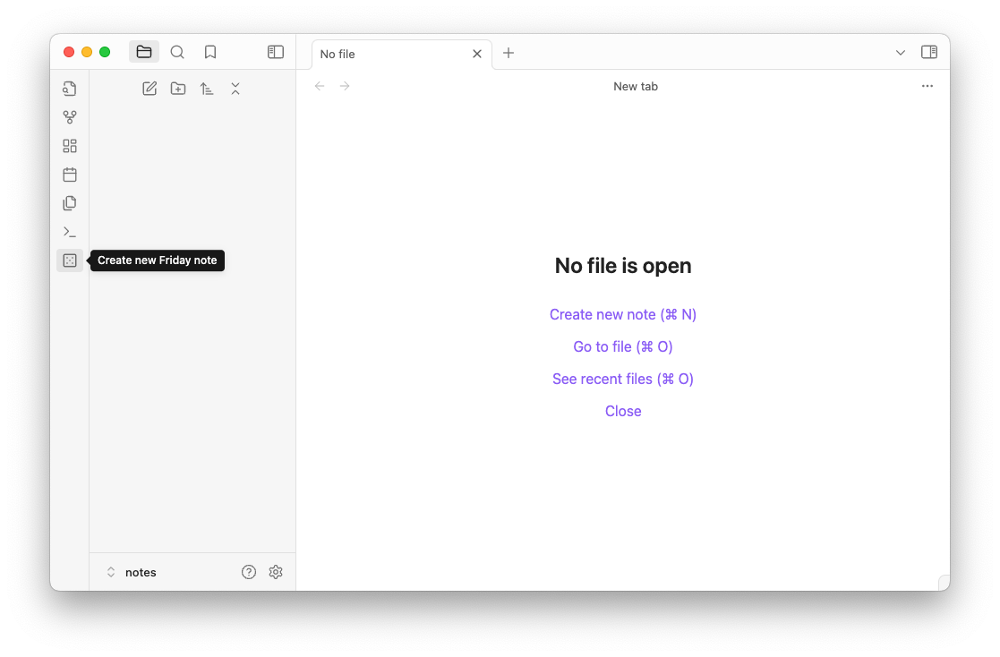

## 创建Friday笔记

### 新建笔记
在 Obsidian 中创建一个新的笔记，点击左边栏Friday创建笔记按钮：

{}
**Friday笔记**  
每个Friday笔记对应的都是一个拥有自己域名的站点。
{}



```yaml
Untitled Friday Site       # 站点标题，表示网站的名称，当前是“未命名的 Friday 网站”  
---  
friday-plugin: enabled     # 激活 Friday 提供的服务  
site: "0"                  # 默认 "0" 表示全新创建网站，不为 "0"，则表示复用缓存，快速构建。  
theme: github.com/mdfriday/theme-hero  # 选定的主题，默认使用的是简单主题 "theme-hero"  
project: empty             # 项目内容路径，需要指定路径才会激活预览功能  
defaultLanguage: en        # 网站的默认语言，需查看主题是否支持多语言使用  
ga: GT-XXXXXXXXX           # Google Analytics 追踪 ID，用于网站访问统计  
domain: demo               # 绑定的自定义域名，"demo"  
---  
Site Description           # 站点描述，可以填写网站的介绍或摘要  
```

{}
**site 配置字段**  
站点 ID，如果出现了一些未知的错误，想从0开始创建，可主动将值修改为"0"。这样将不会重用任何缓存，全新创建，并分配新的站点ID。

**theme 配置字段**  
当前所支持的所有主题，都在[主题列表页面](https://help.mdfriday.com/book/themes/)。可以把选中的主是路径拷贝到这个字段，即可使用指定主题。

**domain 配置字段**  
表示你想将该站点部署到哪个域名下，如 demo.mdfriday.com。当设置为www时，会默认同时部署到根域名，即 mdfriday.com。
{}

### 实例

需求如下：

- 我的书名叫《Mastering Hugo》
- 我想部署到域名: hugo.sunwei.xyz。 
- 并且我想用[Google Analytics](https://analytics.google.com/)给我提供我的站点访问报告。 
- 中文作为默认语言。

这时，我需要将配置信息修改如下：

```yaml
Mastering Hugo
---
friday-plugin: enabled
site: "0"
theme: github.com/mdfriday/theme-book
project: empty
defaultLanguage: zh
ga: G-L6RSX10MGZ
domain: hugo
---

经过深入阅读 Hugo 源码，并结合实际操作，我将所有笔记与实践经验整理成这本书。
它不仅是学习笔记，更是一次系统性的知识沉淀，涵盖源码解析、实战案例和最佳实践。
希望它能帮助更多人深入理解 Hugo，并在实际项目中灵活运用。
让我们一起构建更强大的 Hugo 生态，共同推动这个社区的发展。
```


