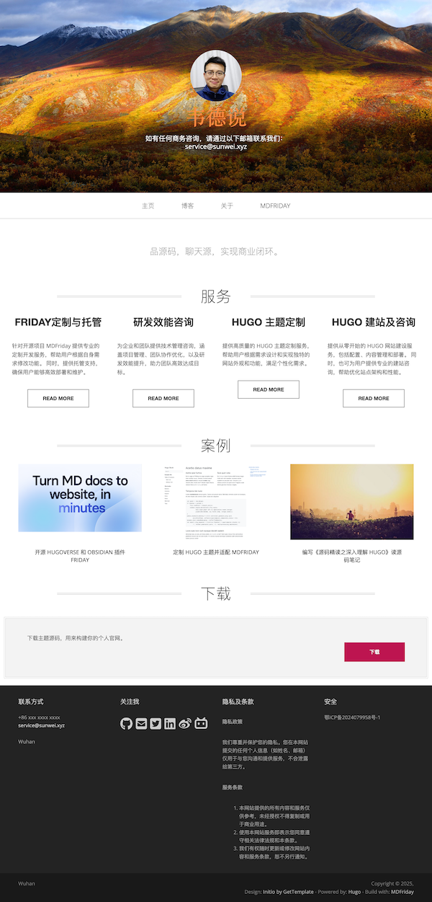

+++
title = "16年+程序员的个人网站应该长啥样？"
date = "2025-01-21"
weight = 1000
+++

程序员就爱捣鼓自己的网站，没工作时，刚工作时，直到现在，都喜欢，哈哈哈哈哈！
最开始用Wordpress，后面用Jekyll上传到Github Pages，再后来用Hugo + Netlify。

现在用Hugoverse，是一个将Markdown笔记转换成站点的工具。
关键是我自己开源的，用自己开源的工具，做自己的官网，那感觉，不要太丝滑。

<!--more-->

## 来吧，展示！

[https://sunwei.xyz](https://sunwei.xyz)

来，告诉我，你们的第一感觉，怎么样？

## 个人网站定位

最开始做个人网站，就想啥都往上放。

- 调试了一个Bug，也要记录一下心酸历程
- 用了个新工具，这个必需得来一篇，不然别人怎么知道我又学了个新工具
- 看到个好东西，怕忘了，高低也得来一篇
- 工作总结？再合适不过了
- 技术洞见，最应该多写的，但哪又能那么容易
- ...

整个的感觉就是大杂烩，事无巨细，都得记录一下。

现在又有了准备个人网站的冲动，但这一次，和以前完全不一样了！

这一次需求变得更明确了些：

- 我希望别人能方便联系我
- 我希望大家知道我能提供哪些商业服务
- 我希望给大家展示一下我的成果 - 把源码笔记整理成书/册子，展示自己的开源项目
- 我希望在互联网上，给自己开块地，好好经营一下个人IP

## 技术人员的可能性

**35+**，一个神奇的数字。  

同样是软件工程师，**在中国**，35岁可能意味着即将被“输送”到社会；而**在国外**，却被视为职业生涯的黄金时期。  

我一直认为，程序员是一个**创造性**的职业，需要极强的脑力投入，用抽象思维和逻辑能力去解决实际问题。但为什么慢慢地，大家都被称作“程序猿”或“软件农民工”了？  

很多人归因于当前的大环境：  

- **项目导向**：互联网行业占主流，做的多是CRUD（增删改查）项目，缺乏深度技术积累。  
- **岗位分布**：架构师岗位稀少，大多数人是项目小组长，没法深入技术领域。  
- **职业发展**：优秀程序员很难专注写代码，因为国内普遍认为只有转管理岗才能发展下去。  
- **拿来主义**：因为节奏快，没时间造轮子。即使现有的轮子是“方”的，也照样用。  

对于这些问题，我没有现成的答案。  

但，**存在即合理**。  
公司看重业务，个人看重技术，冲突似乎不可避免。  

难道，这条路只能这样走下去了吗？
或许，还有其他的可能性值得探索。  

## AI助力打造个人IP和第二曲线

最近了解到《第二曲线》原理，其中一个观点让我很有共鸣：

我们的**第一曲线**，也就是通过基本技能赚取的工资，往往会遇到增长的瓶颈。
刚开始几年，涨薪快，发展空间大，但随着基数变大，公司对你的投入产出比可能就不划算了。
这时候，你在领导眼中，可能慢慢就成了“成本”。

在职场的博弈里，其实有三种可能：  
- **零和**：公司压榨你或者你只赚基本工资。  
- **负和**：双方都输，互相折腾。  
- **正和**：双赢，你和公司都得益。  

显然，**正和**才是最优解。  
要实现这个目标，不仅需要为公司创造价值，还得为自己积累更多东西。
这种积累，不只是技术上的，还可以是**商业化能力**。
说白了，就是把自己打造为一个“品牌”或“产品”，能够为更多人提供服务，而不仅仅是埋头打工。

这其实就是“第二曲线”的精髓：  
**将你的技术积累，变成更大的商业价值**。

在AI飞速发展的今天，原本需要一个团队才能完成的事情，现在一个人就可以搞定。
只要我们既关注业务，又精通技术，就能把这场游戏变成双赢的局面。

我正在探索这条路，也欢迎大家一起交流！